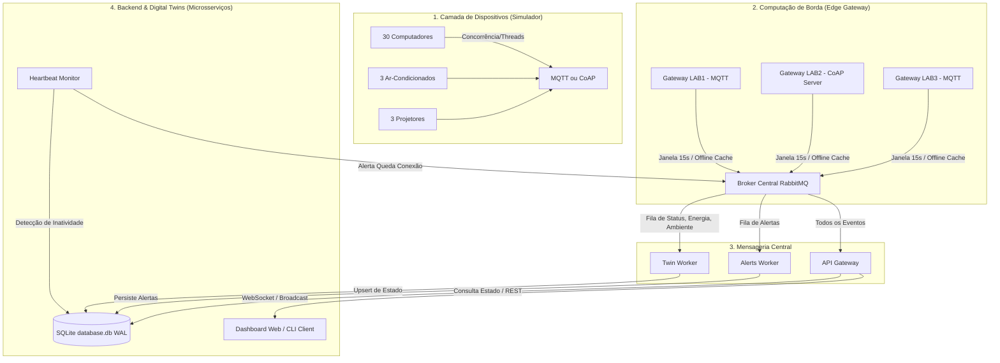

# SmartLab IoT - Monitoramento Inteligente de Laboratórios

Este projeto consiste em um **Sistema Distribuído de Monitoramento Inteligente de Laboratórios de Informática**, integrando simuladores de dispositivos IoT, computação de borda (Edge Gateways), mensageria central assíncrona, microsserviços de backend com representação de Gêmeos Digitais (Digital Twins) e um Dashboard Web em tempo real.

O projeto foi desenvolvido em conformidade com as diretrizes das Práticas Offline 2 e 3 da disciplina de **Programação Concorrente e Distribuída**.

---

## 🏗️ Arquitetura e Estrutura de Camadas

A arquitetura do sistema é dividida em 4 camadas tecnológicas fundamentais:



### 📁 Estrutura de Diretórios
```text
projeto_ph/
├── docker-compose.yml              # Orquestração de todos os microsserviços (RabbitMQ, Mosquitto, Gateways, Simuladores, Backend)
├── mosquitto.conf                  # Configuração dos brokers MQTT locais dos laboratórios
├── requirements.txt                # Dependências globais de desenvolvimento
├── README.md                       # Este arquivo de documentação
│
├── specs/                          # Especificações técnicas detalhadas (REQUISITOS)
│   ├── README.md
│   ├── 0_arquitetura_geral.md
│   ├── 1_simulacao_iot.md
│   ├── 2_edge_gateway.md
│   ├── 3_backend_rabbitmq.md
│   ├── 4_clientes_consumo.md
│   └── 5_cenarios_teste.md
│
├── simulator/                      # Simulador IoT concorrente
│   ├── Dockerfile
│   ├── requirements.txt
│   └── simulator.py                # Threads dos PCs, Ar e Projetor (MQTT/CoAP)
│
├── edge_gateway/                   # Gateway de Borda (Edge Computing)
│   ├── Dockerfile
│   ├── requirements.txt
│   └── edge_gateway.py             # Agregação local de dados e buffer SQLite offline
│
├── backend/                        # Backend Central (Microsserviços)
│   ├── Dockerfile
│   ├── requirements.txt
│   ├── shared_db.py                # Acesso compartilhado ao SQLite em modo WAL com busy_timeout de 15s
│   ├── backend_api.py              # API Gateway (REST, WebSockets e Dashboard estático)
│   ├── worker_twin.py              # Twin & Statistics Worker (Consumidor AMQP e CEP rules)
│   ├── worker_alerts.py            # Alerts Worker (Consumidor AMQP de incidentes)
│   ├── service_monitor.py          # Heartbeat & Connectivity Monitor (Loop de inatividade)
│   └── static/                     # Painel Administrativo Web (SPA HTML/CSS/JS)
│       ├── index.html
│       ├── style.css
│       └── app.js
│
└── cli_client/                     # Cliente de consumo alternativo
    └── cli_mqtt_client.py          # Monitoramento de telemetria colorida via terminal
```

---

## 🛠️ Tecnologias Utilizadas

* **Linguagem Principal:** Python 3.11
* **Protocolos IoT Borda:** MQTT (`paho-mqtt`) e CoAP (`aiocoap`)
* **Brokers locais de Laboratório:** Eclipse Mosquitto (MQTT) e CoAP Server embutido
* **Mensageria Central:** RabbitMQ (AMQP)
* **Backend & API:** FastAPI + Uvicorn + WebSockets
* **Persistência de Gêmeos Digitais:** SQLite
* **Orquestração e Isolamento:** Docker e Docker Compose

---

## ⚙️ Configuração via Variáveis de Ambiente (.env)

O sistema suporta configuração dinâmica de portas, credenciais e intervalos de monitoramento por meio de um arquivo `.env` localizado na raiz do projeto.

Para customizar o comportamento:
1. Copie o arquivo de exemplo:
   ```bash
   cp .env.example .env
   ```
2. Edite as variáveis no arquivo `.env` conforme necessário (ex: alterar portas locais, ajustar o intervalo de atualização dos simuladores `SIMULATION_INTERVAL` ou a janela de agregação dos gateways `AGGREGATION_WINDOW`).
3. Inicie os contêineres:
   ```bash
   docker compose up --build
   ```

---

## 🚀 Guia de Execução (Docker Completo)

Como toda a infraestrutura está conteinerizada, você não precisa instalar nenhuma dependência diretamente no seu computador (host), bastando ter o **Docker** e o **Docker Compose** instalados.

### 1. Iniciar o Sistema
Abra o terminal na pasta raiz do projeto e execute:
```bash
docker compose up --build
```

Isso fará o download das imagens necessárias, compilará os contêineres locais e iniciará todos os serviços integrados.

### 2. Acessar o Dashboard Web
Abra o navegador e acesse:
👉 **[http://localhost:8000](http://localhost:8000)**

O painel é responsivo, conta com tema escuro (*dark mode*), visual transparente (*glassmorphism*) e exibe atualizações em tempo real via **WebSockets**.
* **Visualização de Dispositivos:** Exibe a grade de 10 PCs por laboratório. Os blocos mudam de cor conforme seu estado (Verde: Ativo, Amarelo: Ocioso, Vermelho: Alerta, Cinza: Offline).
* **Métricas Consolidadas:** Mostra médias agregadas de CPU, RAM, temperatura ambiente da sala e consumo de energia calculados pela borda.
* **Inspetor de Gêmeo Digital:** Clique em qualquer computador da grade para ver seus dados específicos (aplicação aberta, consumo de rede e temperatura interna).

### 3. Executar o Cliente MQTT de Tempo Real (CLI)
Para visualizar as teleprojeto_phmetrias e alertas brutos no seu terminal através do protocolo MQTT (sem instalar Python no host):
```bash
docker run -it --rm --network projeto_ph_iot_network -v ${PWD}:/app -w /app python:3.11-alpine sh -c "pip install colorama paho-mqtt && python cli_client/cli_mqtt_client.py --host mosquitto-lab1"
```
*(Você pode mudar o parâmetro `--host mosquitto-lab1` para `mosquitto-lab3` para ouvir o Lab 3).*

---

## ⚙️ Simulação e Controle de Cenários

Para facilitar a apresentação em laboratório, o painel web oferece botões no topo de cada laboratório para alterar o cenário de simulação dinamicamente (enviando uma chamada `POST` para o backend, que os simuladores consultam em tempo real):

1. **Normal:** Carga leve de processamento (CPU entre 5% e 40%), temperatura ambiente da sala estável em ~22°C.
2. **Prova (Pico de Uso):** Todos os computadores mudam seu estado para `EM_PROVA` e elevam o uso de CPU (70% a 90%) e RAM de forma contínua.
3. **Falha AC:** O ar-condicionado é desligado. A temperatura ambiente começa a subir progressivamente. Quando ultrapassa 30°C, gera um alerta de ambiente e, em seguida, os processadores das máquinas superaquecem, disparando múltiplos alertas no feed.
4. **Estresse (Sobrecarga):** Dispara o processamento para >95% em todas as máquinas de uma vez, provocando alertas de CPU Crítica.
5. **Anomalia:** Simula incidentes de segurança. Determinados computadores do laboratório passam a rodar um software não autorizado (ex: um minerador de cripto em background) e ativam a flag de segurança `SOFTWARE_NAO_AUTORIZADO`, disparando alertas de severidade `CRITICAL`.

---

## 🔌 Portas e Redes de Comunicação (Host Mappings)

Caso queira interagir com a infraestrutura diretamente, o Docker Compose expõe as seguintes portas no host:

| Serviço | Porta Exposta | Descrição |
| :--- | :--- | :--- |
| **FastAPI Backend** | `8000` | API REST, WebSocket endpoint `/ws` e Dashboard Web em `/` |
| **RabbitMQ Management** | `15672` | Painel web de gerenciamento do broker RabbitMQ (guest/guest) |
| **RabbitMQ Broker** | `5672` | Comunicação AMQP centralizada |
| **Mosquitto LAB1** | `1883` / `9001` | Broker MQTT local do LAB1 (normal / websockets) |
| **Mosquitto LAB3** | `1884` / `9002` | Broker MQTT local do LAB3 (normal / websockets) |
| **Gateway LAB2 (CoAP)** | `5683` (UDP) | Porta do servidor CoAP de borda do LAB2 |
