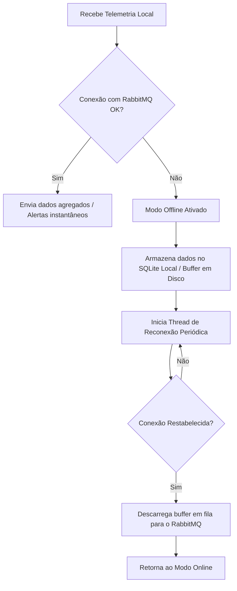

# Spec 2: Gateway de Borda (Edge Computing)

Este documento descreve as responsabilidades do Gateway de Borda de cada laboratório, incluindo a coleta local de dados, o processamento de stream preliminar, a detecção de anomalias em tempo real e a resiliência offline.

---

## 1. Estrutura de Coleta Local

Cada laboratório possui sua própria instância de Gateway de Borda rodando em um contêiner separado. A coleta é adaptada para o protocolo de cada sala:

* **LAB1 (Gateway MQTT):** O contêiner de Gateway executa um Broker MQTT (Mosquitto) e um script Python coletor (`edge_gateway.py`) que assina o tópico curinga `laboratorio/LAB1/dispositivo/+/telemetria`.
* **LAB2 (Gateway CoAP):** O script Python coletor roda um servidor CoAP (escutando na porta UDP `5683`) com recursos mapeados para receber mensagens do simulador.
* **LAB3 (Gateway MQTT):** Similar ao LAB1, com Broker Mosquitto mapeado na porta externa `1884` e escutando o tópico curinga `laboratorio/LAB3/dispositivo/+/telemetria`.

---

## 2. Processamento e Agregação Local (Redução de Volume)

Para evitar sobrecarregar o RabbitMQ e o backend central com pings brutos a cada 5 segundos de 30+ dispositivos, o Gateway realiza **agregação em janela temporal (windowing)**:

1. **Janela de Agregação:** O Gateway acumula as telemetrias locais por uma janela de **15 segundos** (configurável).
2. **Cálculo de Métricas Consolidadas:** Ao final de cada janela, o Gateway calcula:
   * `cpu_media`: Média aritmética do uso de CPU de todos os computadores ativos no laboratório.
   * `ram_media`: Média aritmética do uso de memória RAM.
   * `temperatura_media`: Média da temperatura dos processadores.
   * `pcs_ativos`: Contagem de computadores com estado `"ATIVO"` ou `"EM_PROVA"`.
   * `energia_total_kwh`: Soma de consumo elétrico (PCs + Ar-Condicionado + Projetor).
3. **Payload Consolidado:** O Gateway publica uma única mensagem agregada para a fila de status no RabbitMQ central.
   
```json
{
  "lab_id": "LAB1",
  "timestamp": "2026-06-22T00:15:00Z",
  "metricas": {
    "cpu_media": 34.2,
    "ram_media": 48.9,
    "temperatura_media": 52.1,
    "pcs_ativos": 7,
    "energia_total_kwh": 2.08
  }
}
```

---

## 3. Detecção de Anomalias em Tempo Real na Borda

Diferente das telemetrias normais que são agregadas, **eventos críticos e anomalias são repassados imediatamente (bypass de latência)** para o RabbitMQ central. O Gateway de Borda avalia cada leitura individual contra regras de limiar:

1. **Superaquecimento de Máquina (CPU Temp):**
   * *Regra:* Temperatura de qualquer PC > 85°C.
   * *Ação:* Envia alerta imediato.
2. **Superaquecimento do Ambiente (Sala):**
   * *Regra:* Temperatura ambiente do laboratório (coletada do Ar-Condicionado) > 30°C.
   * *Ação:* Envia alerta imediato de falha física/térmica.
3. **CPU Crítica individual:**
   * *Regra:* Uso de CPU > 95% em qualquer máquina por mais de 2 leituras seguidas.
   * *Ação:* Envia alerta de lentidão/sobrecarga.
4. **Evento de Segurança:**
   * *Regra:* Presença de campo `evento_seguranca` não nulo na telemetria de um PC.
   * *Ação:* Envia alerta crítico de segurança.

---

## 4. Resiliência de Rede (Modo Offline)

Caso ocorra uma perda de conectividade entre o Gateway de Borda e o RabbitMQ central (backend), o Gateway deve operar em **modo de contingência**:



### Mecanismo de Buffer Local:
* O Gateway utilizará uma tabela leve no **SQLite local** (ex: `gateway_buffer.db`) ou um arquivo JSON rotativo para evitar perda de dados por queda de energia no Gateway.
* A tabela armazena: `id_mensagem`, `tipo_evento` (alerta, telemetria, energia), `payload_json`, `timestamp`.
* Ao se reconectar, as mensagens são publicadas mantendo o timestamp original das leituras.
